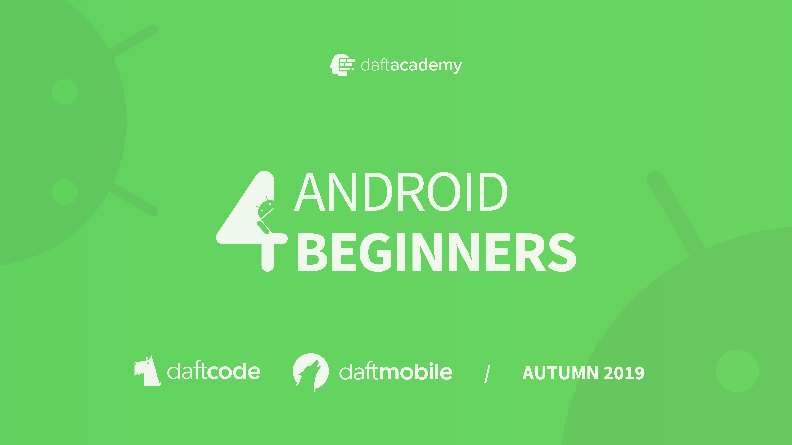
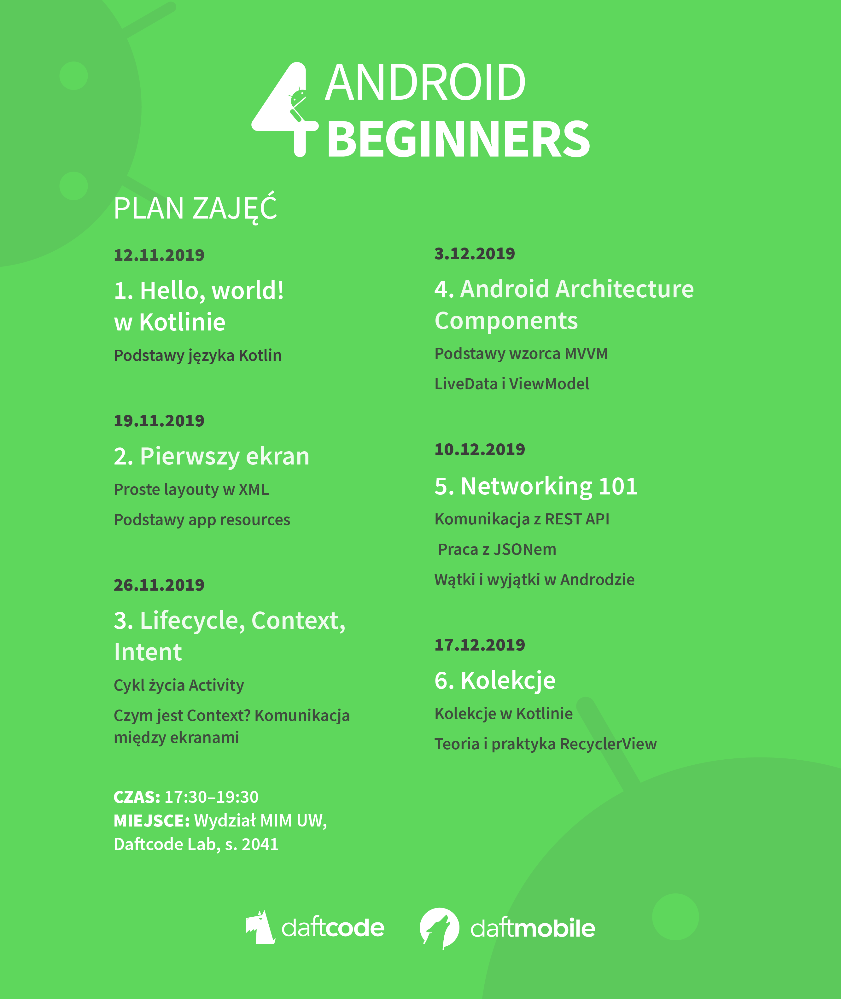
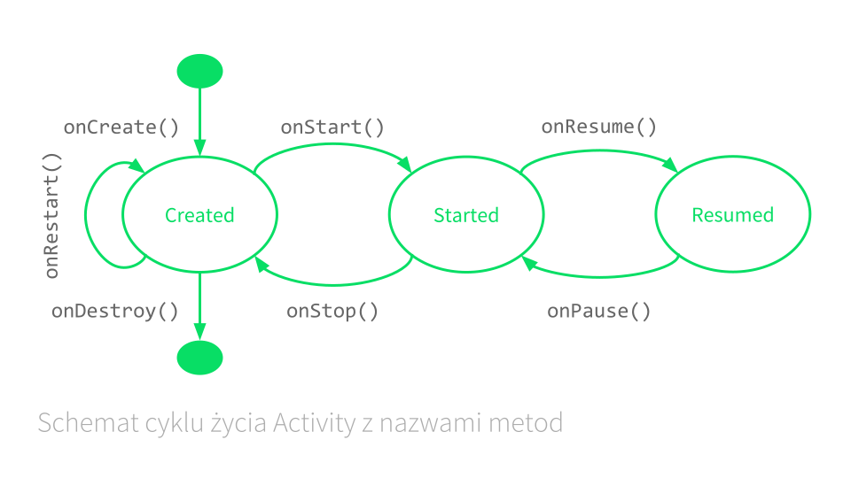

# Zajęcia Android 4 Beginners – MIMUW, jesień 2019

## Plan zajęć

## Lifecycle

## Materiały

- [Kotlin Koans](http://kotlinlang.org/docs/tutorials/koans.html)
- [Android Developers](https://developer.android.com/index.html)
- [Android Architecture Components](https://developer.android.com/topic/libraries/architecture/index.html)

## Kontakt

- [E-mail](mailto:konrad.kowalewski+a4b@daftcode.pl)
